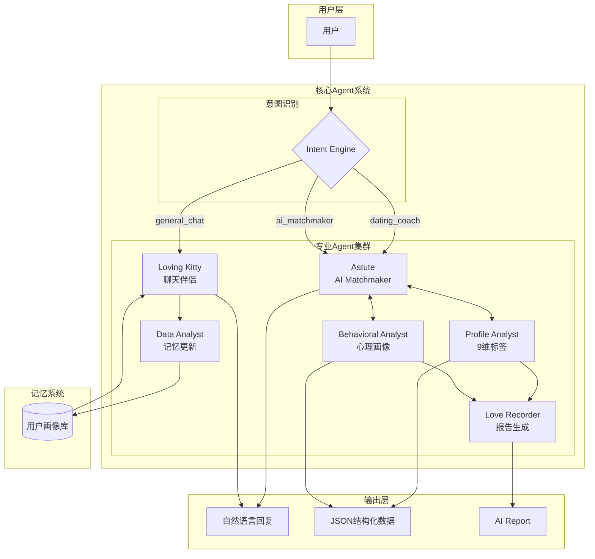
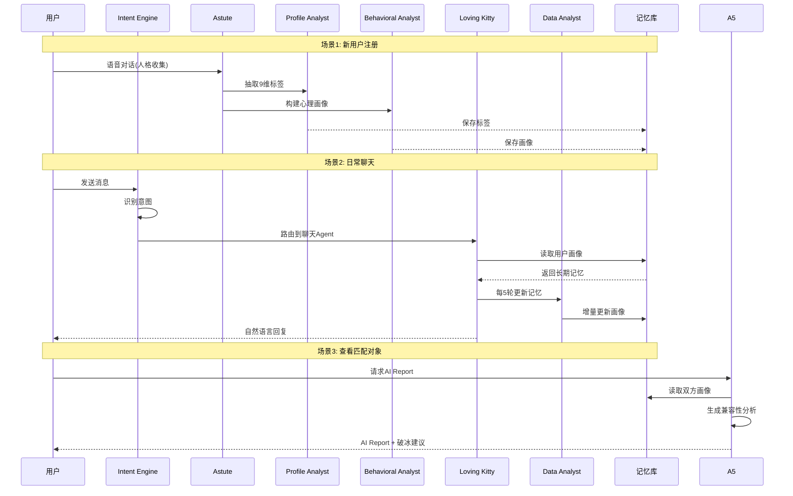
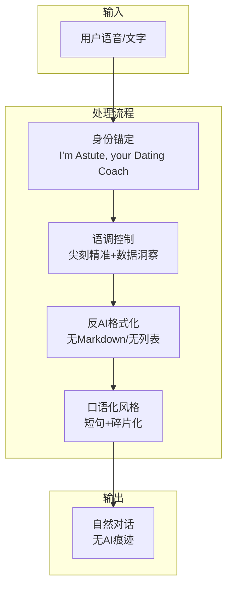
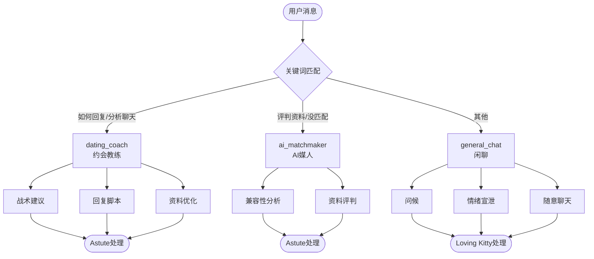
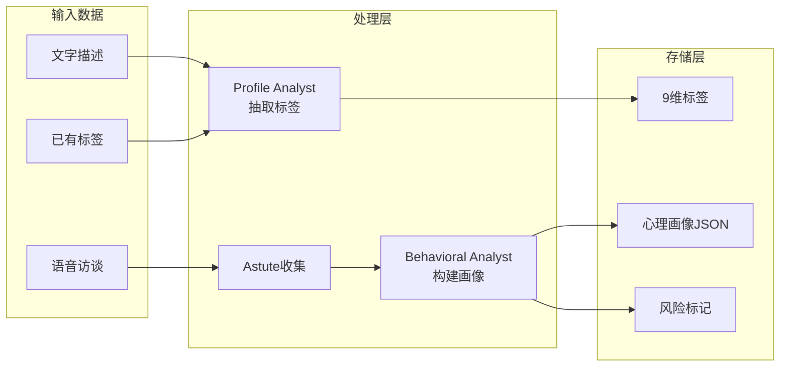
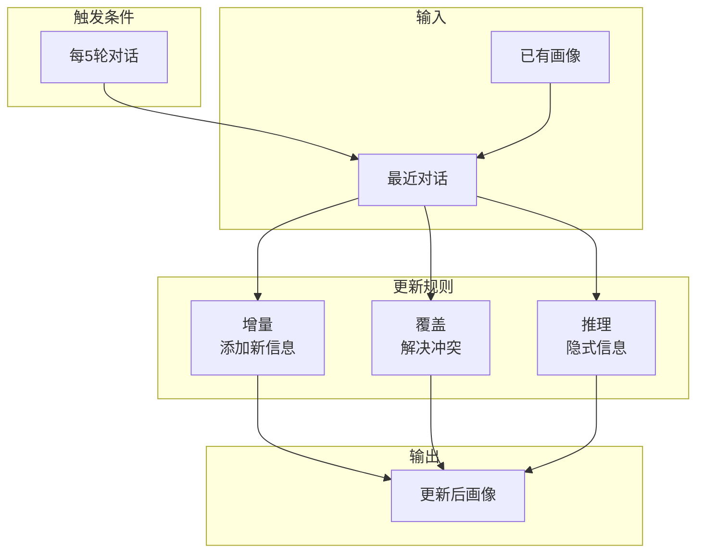
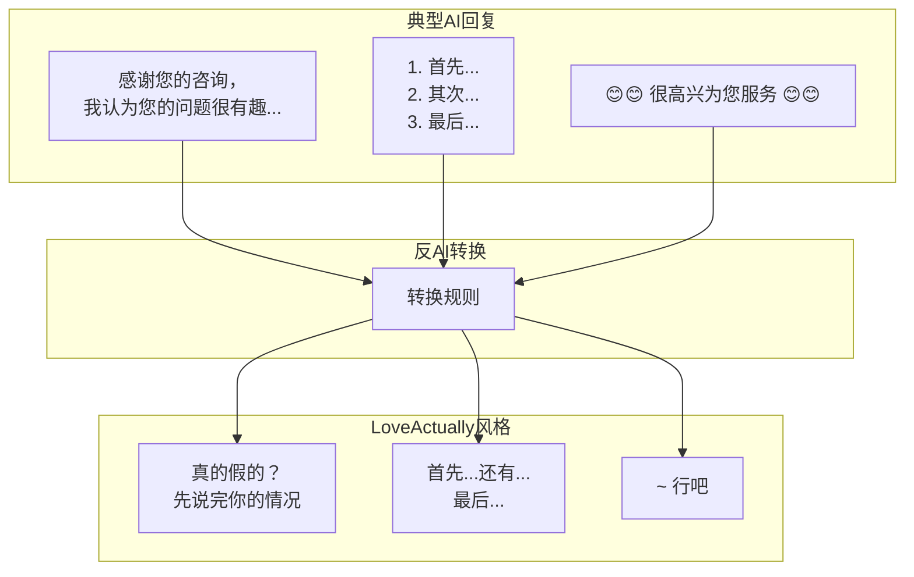
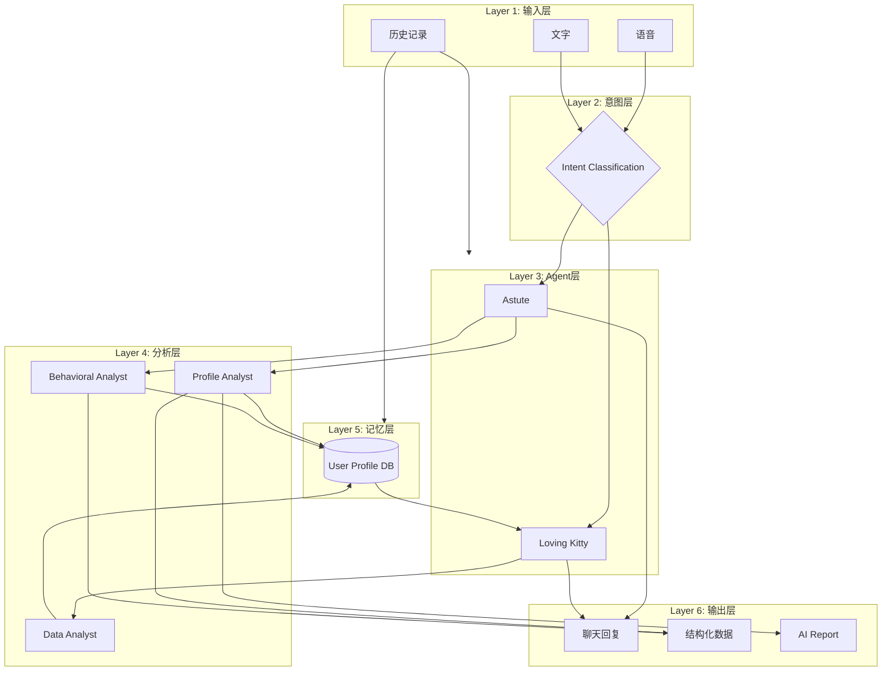
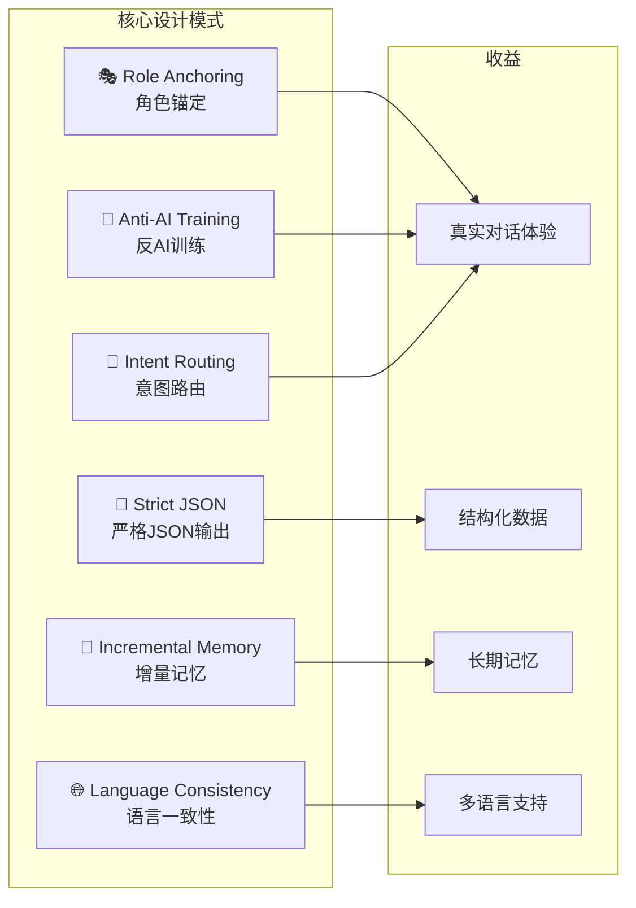
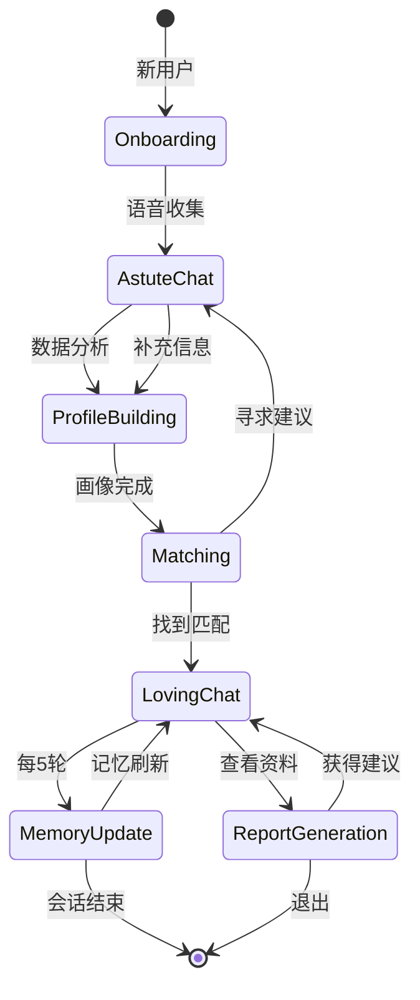

# LoveActually.AI 系统架构图

## 一、整体系统架构

## 二、Agent交互流程

## 三、Astute Agent详解

## 四、意图分类决策树

## 五、用户画像构建流程

## 六、长期记忆更新机制

## 七、反AI设计原则

## 八、数据流全景图

## 九、关键设计模式

## 十、系统状态流转

---

## 图例说明

| 符号 | 含义 |
|-----|------|
| ⭕ 圆形 | 开始/结束节点 |
| 🔷 菱形 | 决策/判断节点 |
| 🟦 矩形 | 处理/Agent节点 |
| 🗄️ 圆柱 | 数据存储 |
| ➡️ 箭头 | 数据流向 |
| --- 虚线 | 异步/后台流程 |
