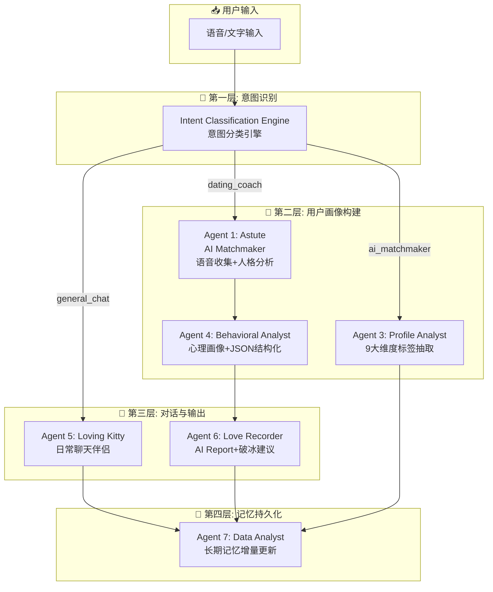
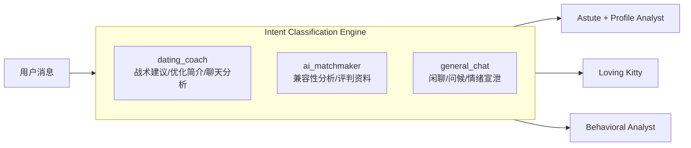
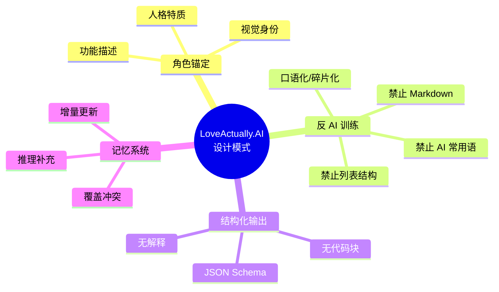
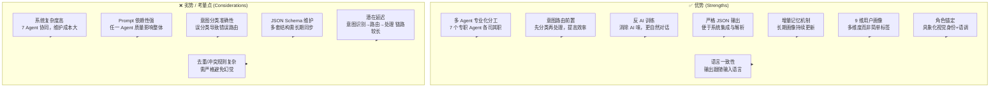
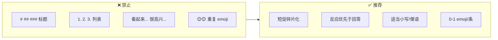
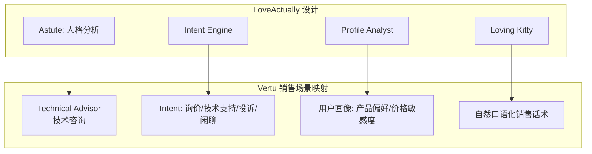

# LoveActually.AI 情感系统 - 快速总览

> 基于 `prompt_analysis.md` 提炼的 Mermaid 流程图，便于快速了解优/劣势

---

## 1. 系统整体架构流程图

---

## 2. 用户意图路由流程

---

## 3. 核心设计模式对比

---

## 4. 优劣分析一览

---

## 5. 反 AI 训练规则 (Loving Kitty)

---

## 6. Vertu Sales Agent 可借鉴映射

---

## 📋 快速速查表

| 维度 | 优势 | 劣势 |
|------|------|------|
| **架构** | 7 Agent 专业化、意图路由前置 | 复杂度高、维护成本大 |
| **对话** | 反 AI 训练、口语化、角色锚定 | Prompt 质量高度敏感 |
| **数据** | JSON 严格输出、增量记忆、9 维画像 | Schema 维护、冲突规则复杂 |
| **体验** | 语言一致、自然碎片化 | 意图误分类影响路由 |
