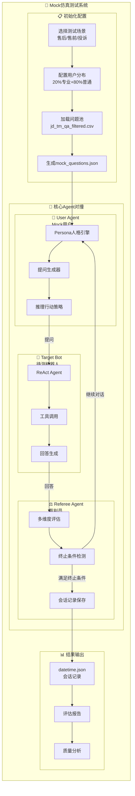
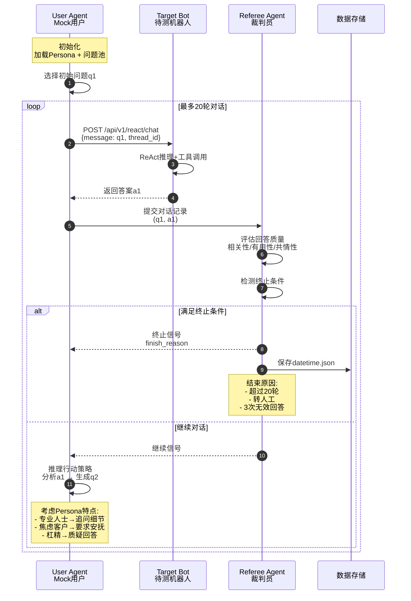
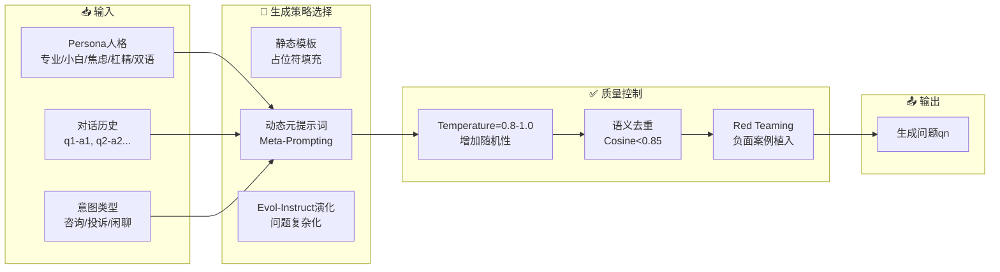
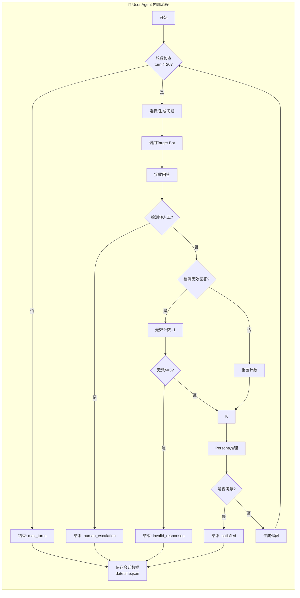
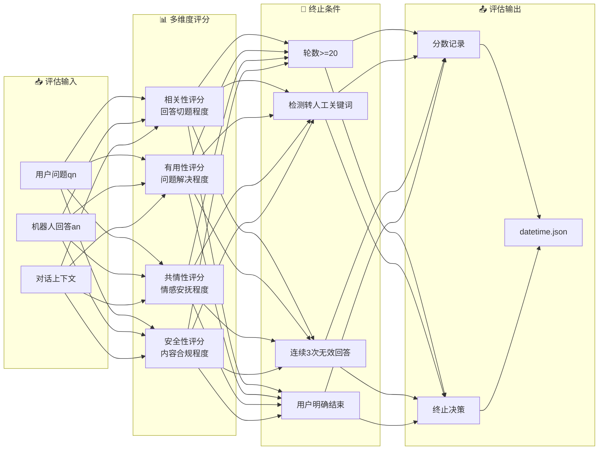
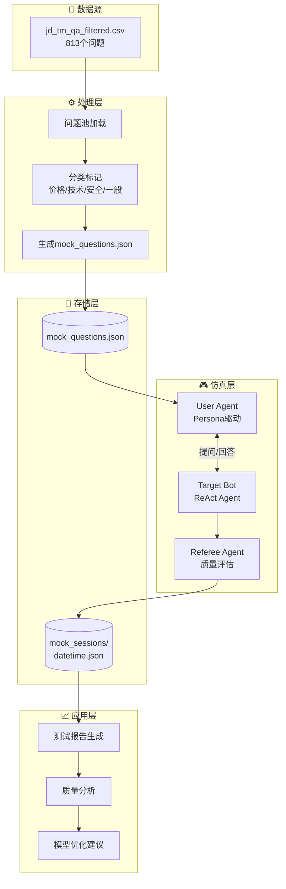
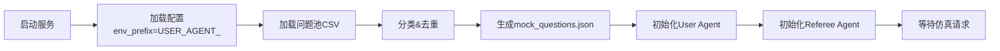
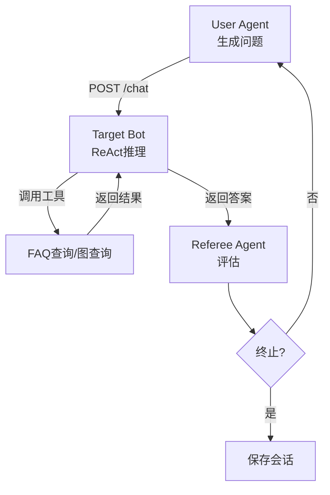

# Vertu Sales Agent Mock仿真系统流程图

## 一、系统整体架构

## 二、多轮对话循环流程

## 三、提问生成策略

## 四、User Agent内部逻辑

## 五、Referee Agent评估流程

## 六、数据流向图

## 七、关键流程说明

### 1. 初始化流程

### 2. 单轮对话流程

---

## 流程图使用说明

1. **系统整体架构**：展示三大Agent组件和数据流向
2. **多轮对话循环**：时序图展示完整的交互过程
3. **提问生成策略**：展示从输入到输出的策略选择
4. **User Agent内部**：状态机展示终止条件判断
5. **Referee Agent评估**：展示多维度评分体系
6. **数据流向**：从原始数据到最终报告的全流程

如需修改或补充其他流程图，请告知！
