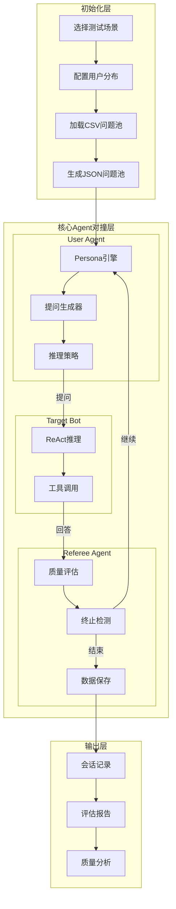
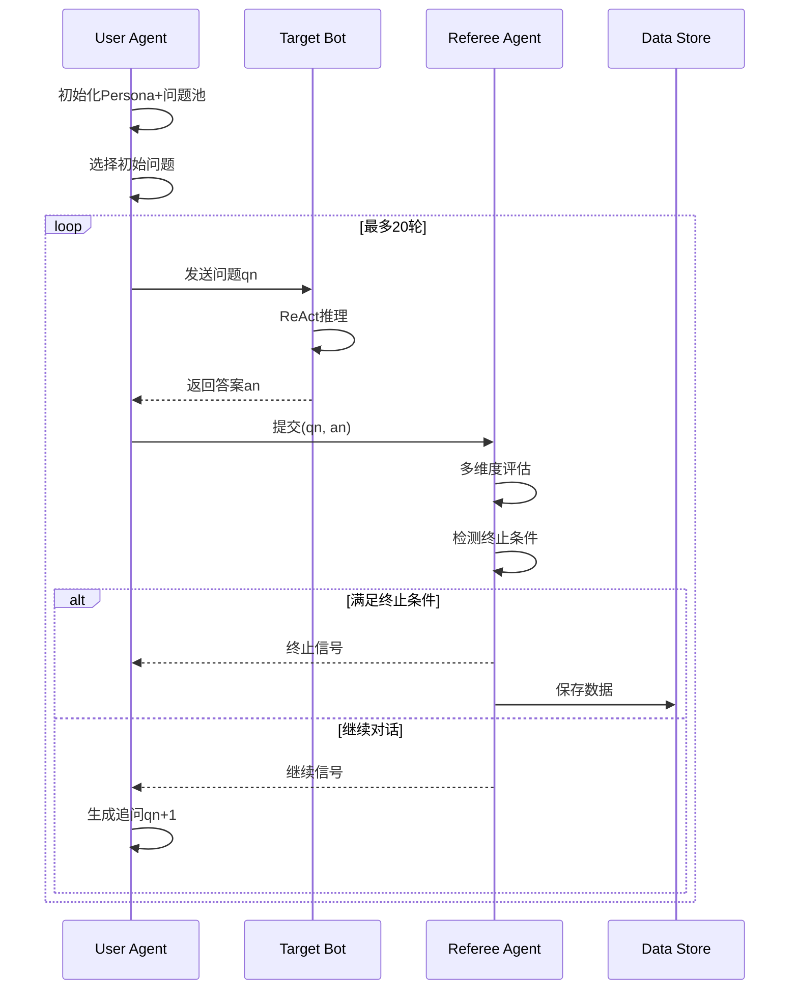
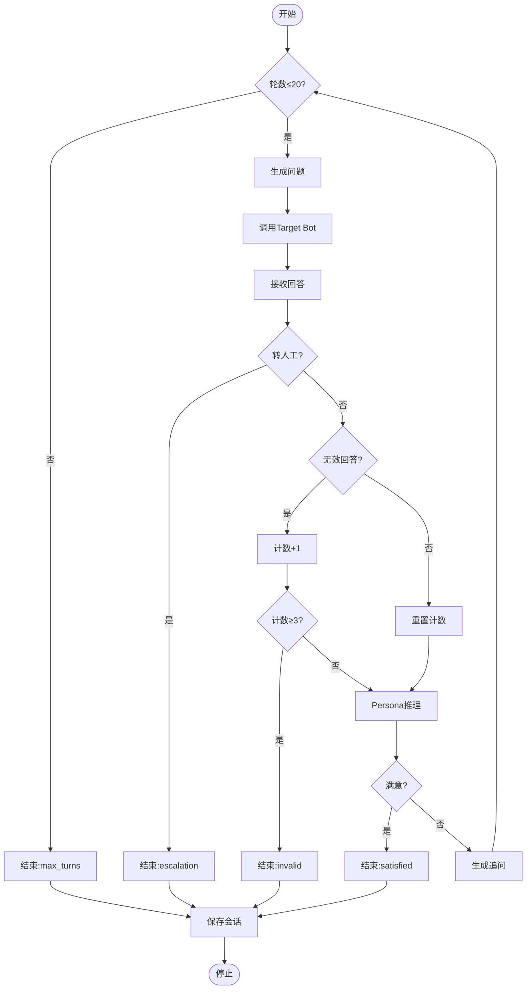
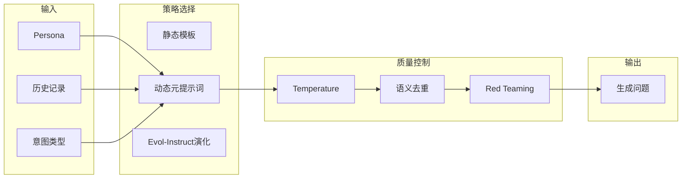
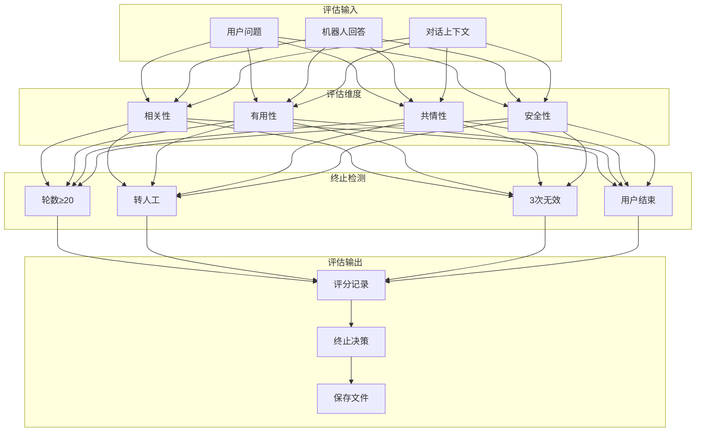
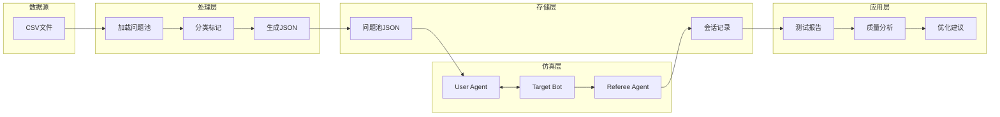
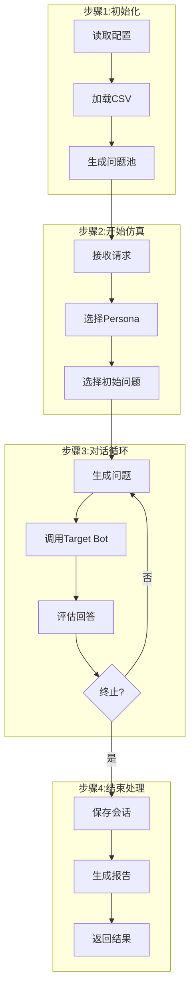
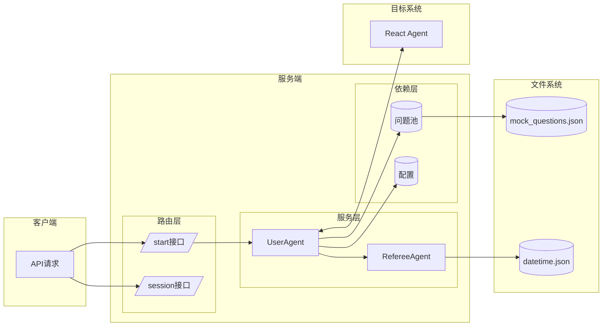
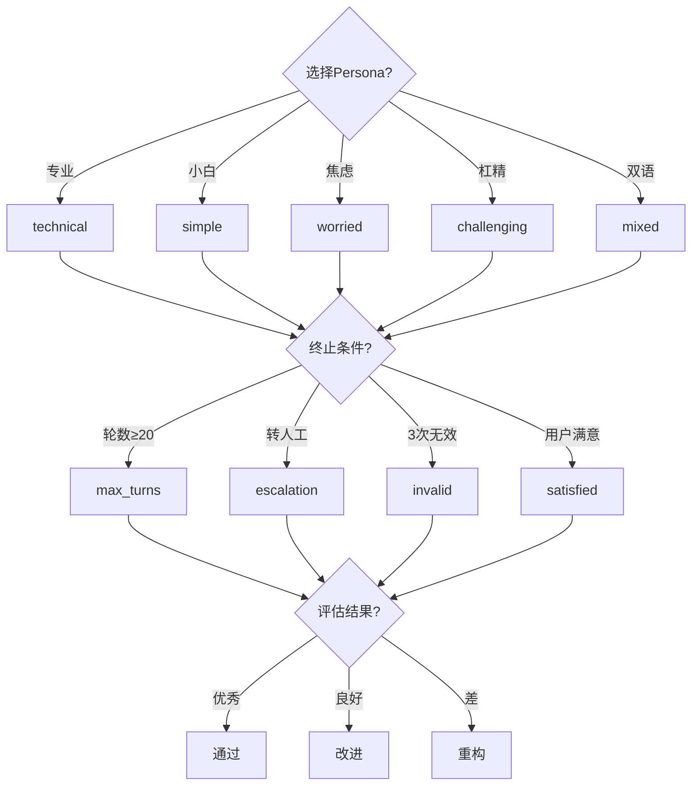
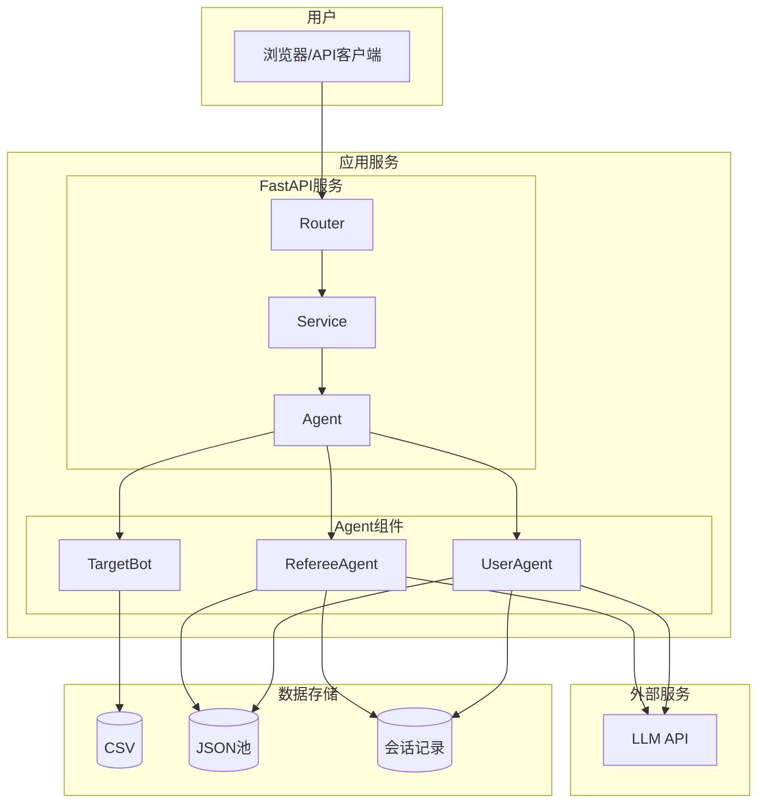

# Vertu Sales Agent Mock仿真系统流程图 (方正版)

## 一、系统整体架构

## 二、多轮对话循环

## 三、User Agent内部状态机

## 四、提问生成策略矩阵

## 五、Referee Agent评估流程

## 六、数据流向图

## 七、完整工作流程

## 八、组件交互图

## 九、关键决策点

## 十、部署架构

---

## 设计说明

本版本流程图优化了以下方面：

1. **布局方正**: 使用TB/LR方向控制，避免斜向连接
2. **边长控制**: 模块化设计，减少长距离连接
3. **对齐整齐**: 使用subgraph分组，保持视觉整齐
4. **逻辑清晰**: 每个流程图专注单一职责
5. **可读性强**: 标签简洁，避免过长文字
