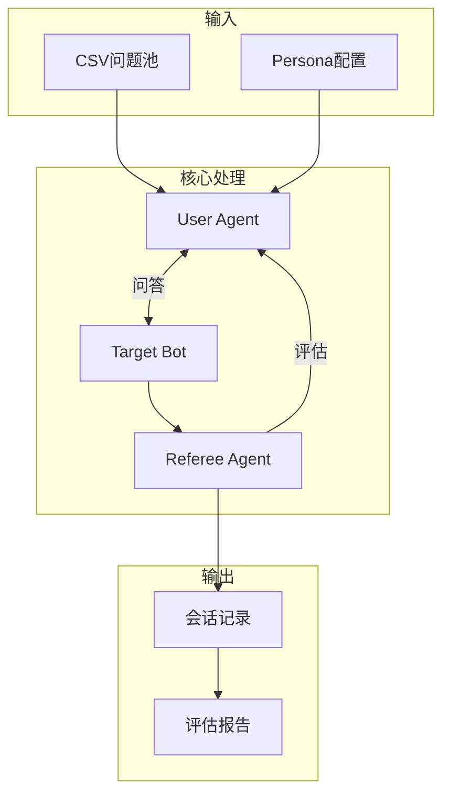
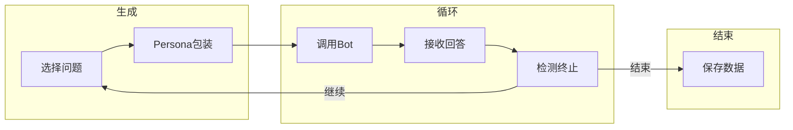
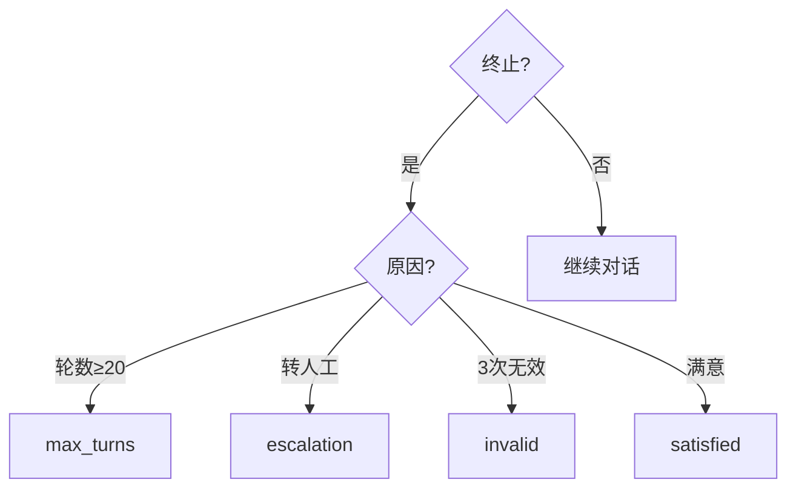
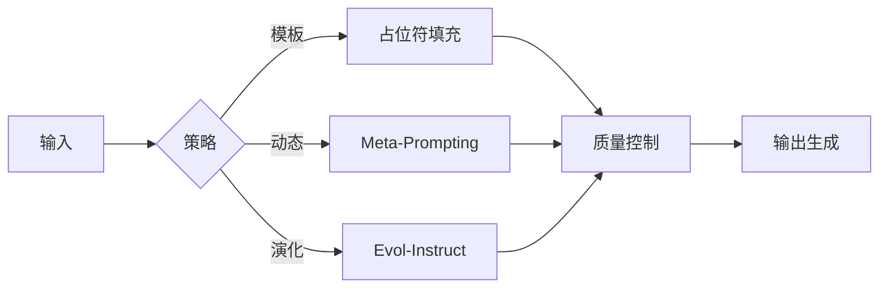
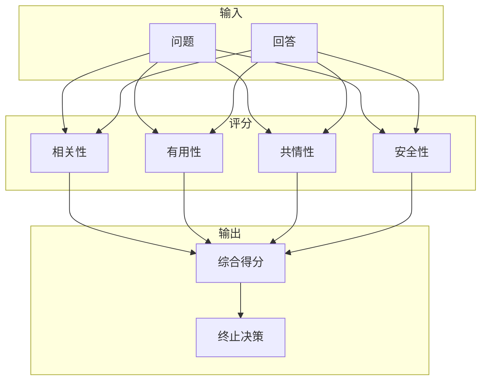
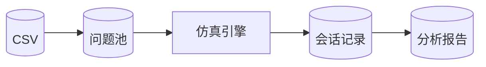
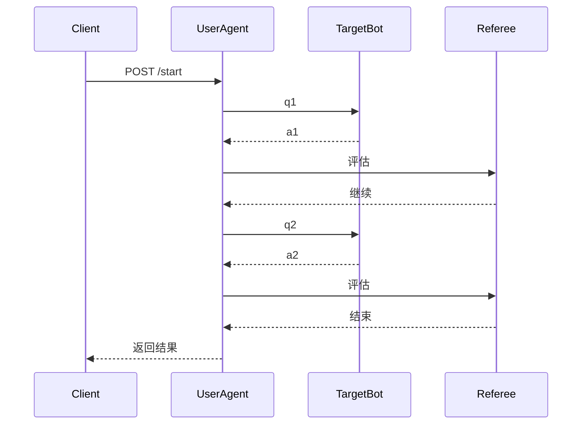
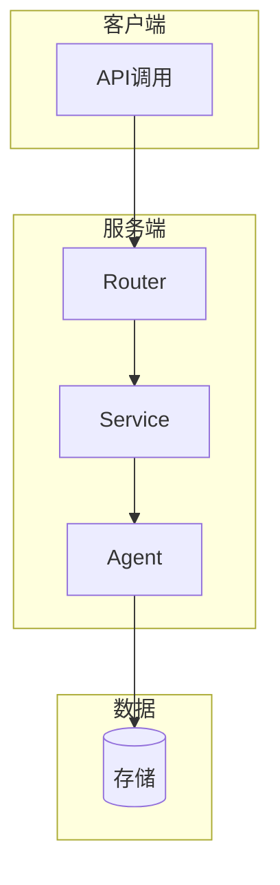

# Vertu Sales Agent Mock仿真系统流程图 (紧凑正方形版)

## 一、系统核心架构

## 二、User Agent内部

## 三、终止条件检测

## 四、提问生成策略

## 五、Referee评估维度

## 六、数据流转

## 七、API交互

## 八、部署架构

---

## 设计原则

1. **正方形布局**: 每个流程图控制在3-4层深度
2. **无长链**: 最大节点数8个，避免纵向长链条
3. **模块化**: 使用subgraph分组，内部紧凑
4. **并行展示**: 同级节点横向排列
