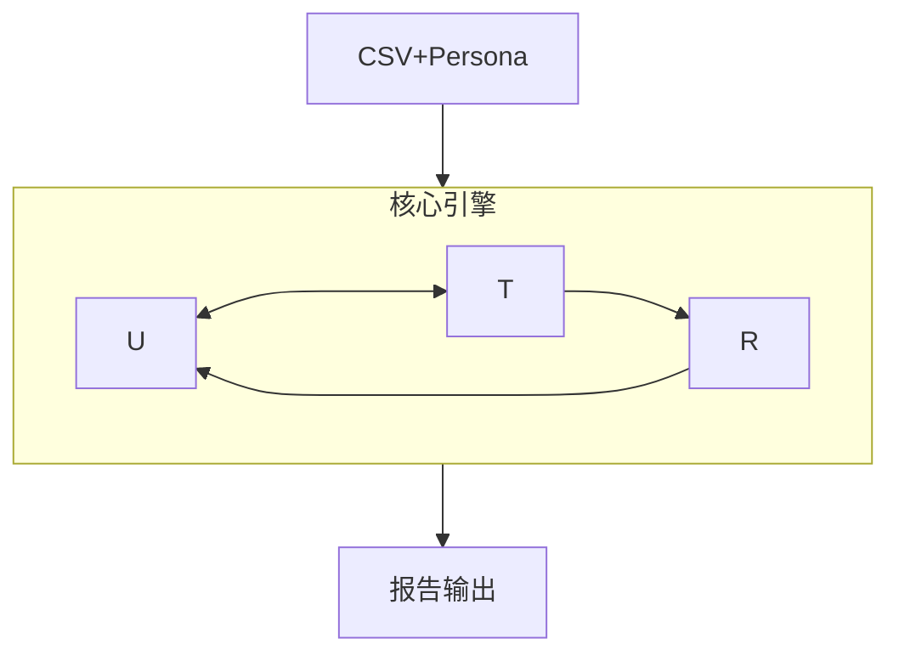
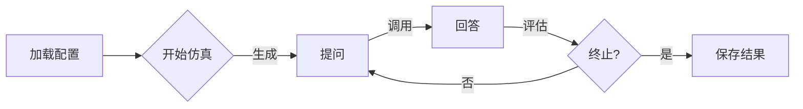
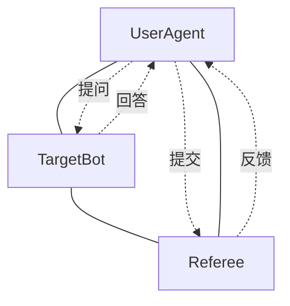
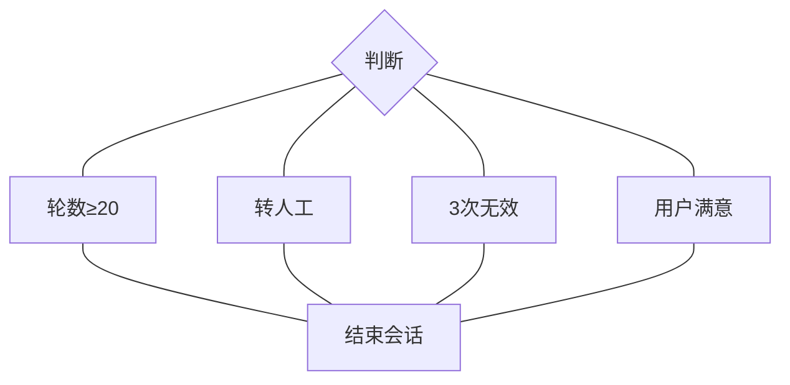
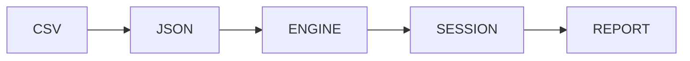
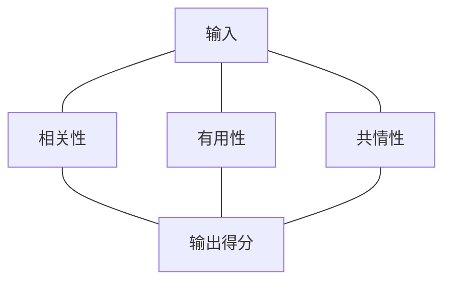
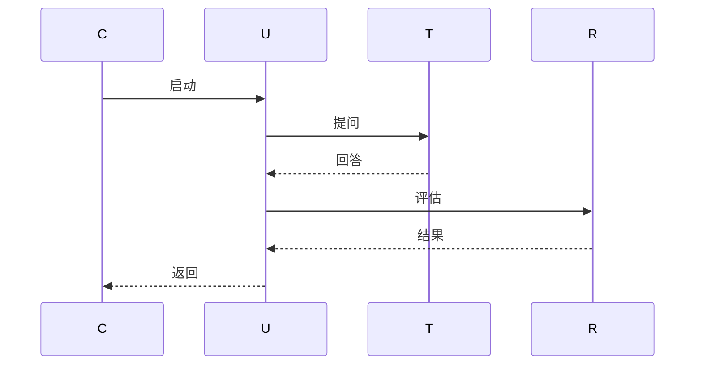
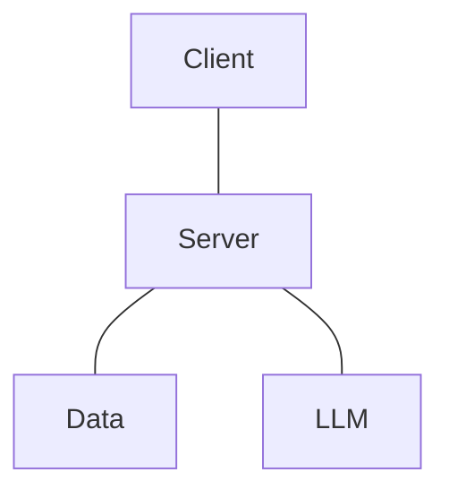

# Vertu Sales Agent Mock仿真系统流程图 (极简正方形版)

## 一、系统总览

```mermaid
flowchart TB
    I[CSV+Persona] --> C[核心引擎]
    C --> O[报告输出]

    subgraph C["核心引擎"]
        direction LR
        U & T & R
    end

    U <---> T
    T --> R
    R --> U
```

## 二、处理流程

```mermaid
flowchart LR
    A[加载配置] --> B{开始仿真}
    B -->|生成| C[提问]
    C -->|调用| D[回答]
    D -->|评估| E{终止?}
    E -->|否| C
    E -->|是| F[保存结果]
```

## 三、Agent交互

```mermaid
flowchart TB
    U[UserAgent] --- T[TargetBot]
    T --- R[Referee]
    R --- U

    U -.->|提问| T
    T -.->|回答| U
    U -.->|提交| R
    R -.->|反馈| U
```

## 四、终止判断

```mermaid
flowchart TB
    J{判断} --- K1[轮数≥20]
    J --- K2[转人工]
    J --- K3[3次无效]
    J --- K4[用户满意]

    K1 & K2 & K3 & K4 --- L[结束会话]
```

## 五、数据流

```mermaid
flowchart LR
    CSV --> JSON --> ENGINE --> SESSION --> REPORT
```

## 六、评估维度

```mermaid
flowchart TB
    I[输入] --- E1[相关性]
    I --- E2[有用性]
    I --- E3[共情性]

    E1 & E2 & E3 --- O[输出得分]
```

## 七、API调用

```mermaid
sequenceDiagram
    C->>U: 启动
    U->>T: 提问
    T-->>U: 回答
    U->>R: 评估
    R-->>U: 结果
    U-->>C: 返回
```

## 八、部署结构

```mermaid
flowchart TB
    Client --- Server --- Data
    Server --- LLM
```

---

## 设计说明

- 每个图最多6个节点
- 最大深度3层
- 优先使用并行布局
- 去除所有冗余连接
